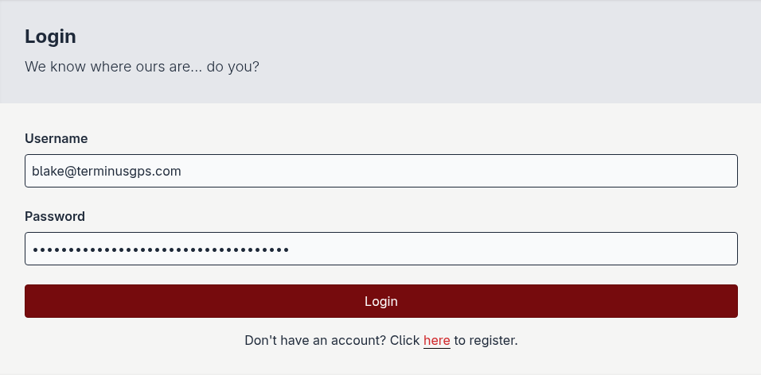
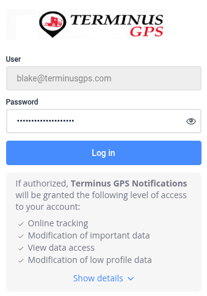
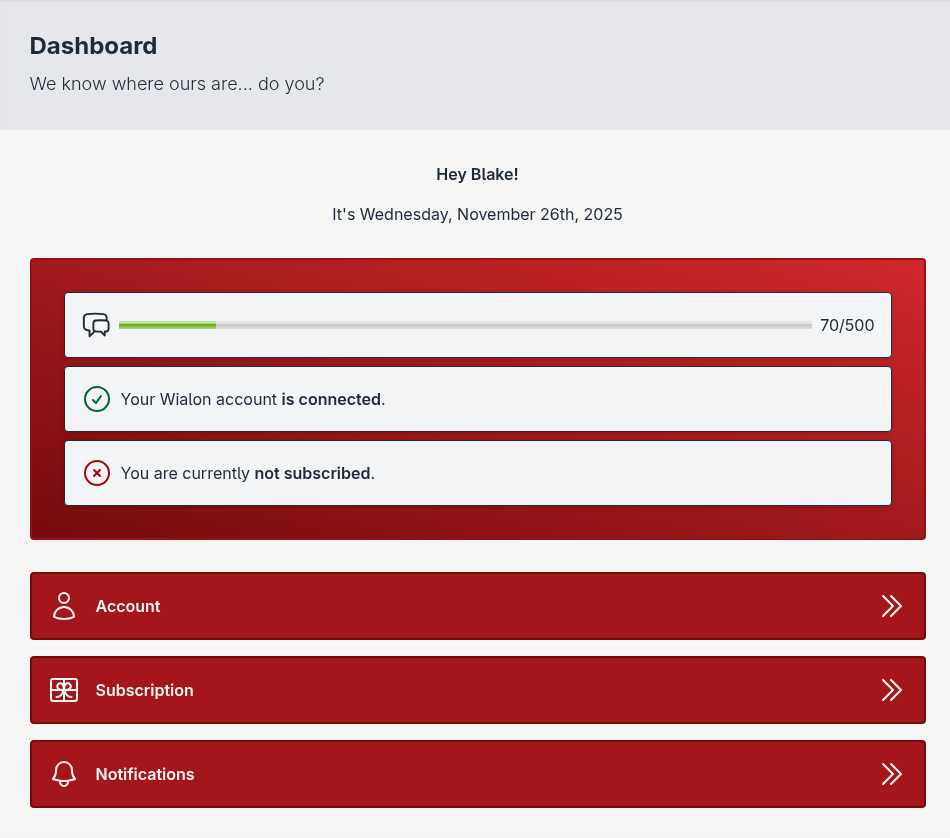

Connecting your Wialon account
==============================

To connect your Wialon account to your *Terminus GPS Notifications* account, you must have already :doc:`created a Terminus GPS Notifications account <creating_an_account>`.

1. `Login`_ to the platform.

2. Navigate to the `account`_ page.

.. image:: ../images/account_page_connect_full.png

3. Click the *Connect* button.

.. image:: ../images/account_page_connect.png

4. Enter your **Wialon credentials** into the form.

5. Refresh the page once you have been redirected back to the `account`_ page.

If properly connected, your `dashboard`_ will be updated to reflect your connected Wialon account.

.. _account: https://api.terminusgps.com/account/
.. _dashboard: https://api.terminusgps.com/dashboard/
.. _login: https://api.terminusgps.com/login/
.. _subscription: https://api.terminusgps.com/subscription/
