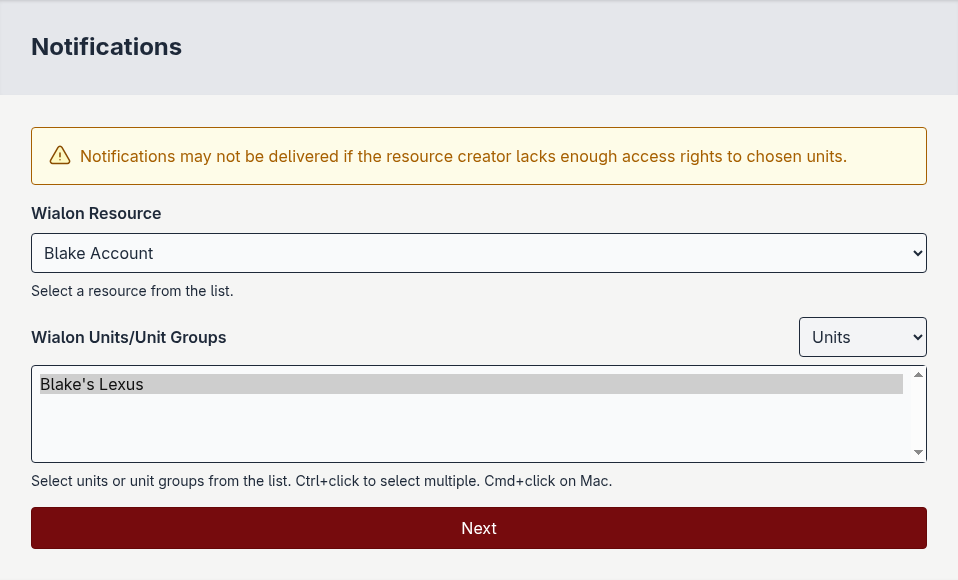
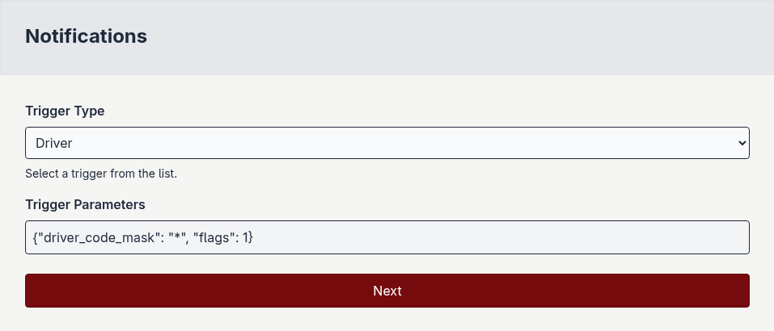

Creating a live notification
============================

.. warning:: Without an :doc:`active subscription <subscribing>`, notification messages **will not be delivered** to any destination phone numbers.

1. `Login`_ to the platform.

.. image:: ../images/login_page_filled.png

2. Navigate to the `notifications`_ page.

.. image:: ../images/notifications_page.png

3. Click the *New notification* button.

.. note:: During notification creation, please do not refresh the page or you will lose your progress.

4. Select a resource from the list.

.. image:: ../images/notifications_page_select_resource.png

5. Select units/unit groups from the list.

6. Select a notification trigger type from the list.

.. image:: ../images/notifications_page_select_trigger.png

7. Set notification trigger parameters.

.. note:: If you click *next* before clicking *Save parameters*, you'll have to re-enter your notification trigger parameters.

8. Click the *Save parameters* button.

9. Click the *next* button.

10. Choose a notification method.

.. image:: ../images/notifications_page_select_method.png

- SMS: Delivers the notification message via SMS to destination phone numbers.
- Voice: Delivers the notification message via text-to-speech to destination phone numbers.

11. Provide a notification name.

.. image:: ../images/notifications_page_set_name.png

12. Provide a notification message. This is the "main" message to be delivered to destination phone numbers.

.. image:: ../images/notifications_page_set_message.png

Destination phone numbers will recieve a constructed message using what you provide here during creation.

The final message is structured as follows: ``[DATETIME] [UNIT NAME] [LOCATION] MESSAGE``

Example messages delivered to destination phone numbers:

* ``[2025-12-31 13:04:29] [Blake's Lexus] [123 Main St] Your vehicle had its ignition switched on.``
* ``[2025-12-31 13:04:29] [UN38203982] A driver was assigned to your vehicle.``
* ``[2025-12-31 13:04:29] [Pete Truck] [123 Main St] Your vehicle's speed exceeded 40mph.``
* ``[2025-12-31 13:04:29] [Speed Demon] Your device was unhealthy.``

.. note:: There should always be a date and time added to the message, but unit name and location may not be provided by Wialon when the notification is triggered.

13. Click the *Create Notification* button. You'll see a message confirming notification creation before you're redirected back to your `notification list`_.

.. image:: ../images/notifications_page_filled.png

.. _notifications: https://api.terminusgps.com/notifications/
.. _notification list: https://api.terminusgps.com/notifications/
.. _login: https://api.terminusgps.com/login/
