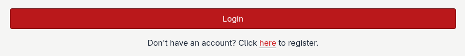

Logging in
==========

1. :doc:`Create an account <creating_an_account>` if you haven't already.

2. Navigate to the *Terminus GPS Notifications* `login`_ page.

.. image:: ../images/login_page.png

3. Enter the email address and password associated with your account.

.. image:: ../images/login_page_filled.png

4. Click the *Login* button to be redirected to your `dashboard`_ page.

.. _dashboard: https://api.terminusgps.com/dashboard/
.. _login: https://api.terminusgps.com/login/
